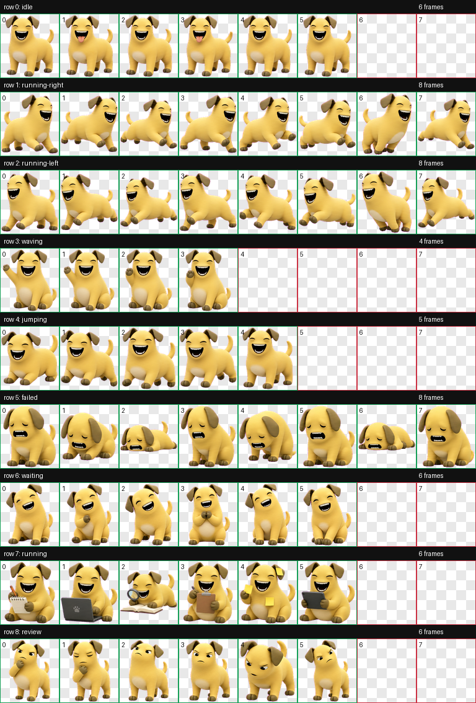

# 奶狗 Codex Pet

这是一个 Codex 桌面端自定义桌宠，名字是“奶狗”。

## 内容

- `pet.json`: Codex pet 配置文件
- `spritesheet.webp`: 最终 9 行动画图集
- `qa/contact-sheet.png`: 动作总览
- `qa/previews/*.gif`: 每个动作的 GIF 预览
- `qa/validation.json`: 图集校验结果
- `qa/review.json`: 抽帧检查结果
- `qa/run-summary.json`: 生成摘要

## 安装

将本目录复制到 Codex 的 pets 目录：

```text
C:\Users\付辰阳\.codex\pets\naigou
```

确保目录内包含：

```text
pet.json
spritesheet.webp
```

然后在 Codex 桌面端中选择 `naigou`，或将全局状态里的 `selected-avatar-id` 设置为 `naigou`。

## 动作

- `idle`: 待机，持续摇尾巴，偶尔吐舌头
- `running-right`: 向右移动
- `running-left`: 向左移动
- `waving`: 坐姿打招呼
- `jumping`: 跳跃
- `failed`: 失败/不开心
- `waiting`: 等待/卖萌
- `running`: 工作中
- `review`: 疑惑/审阅

## 预览


